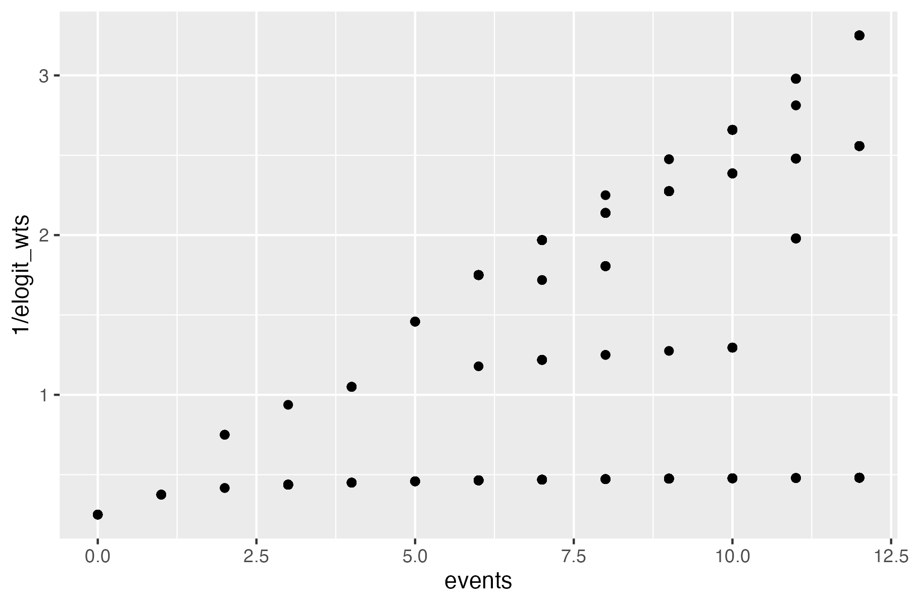
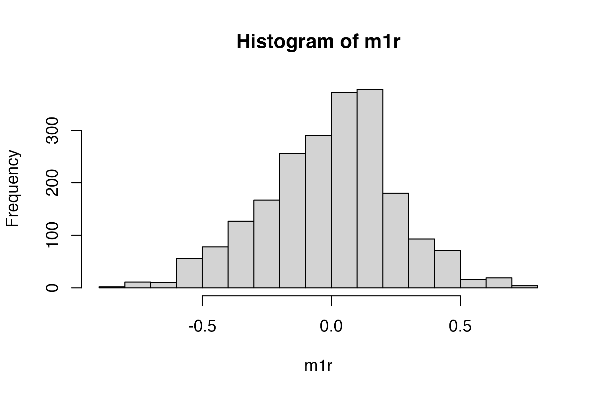
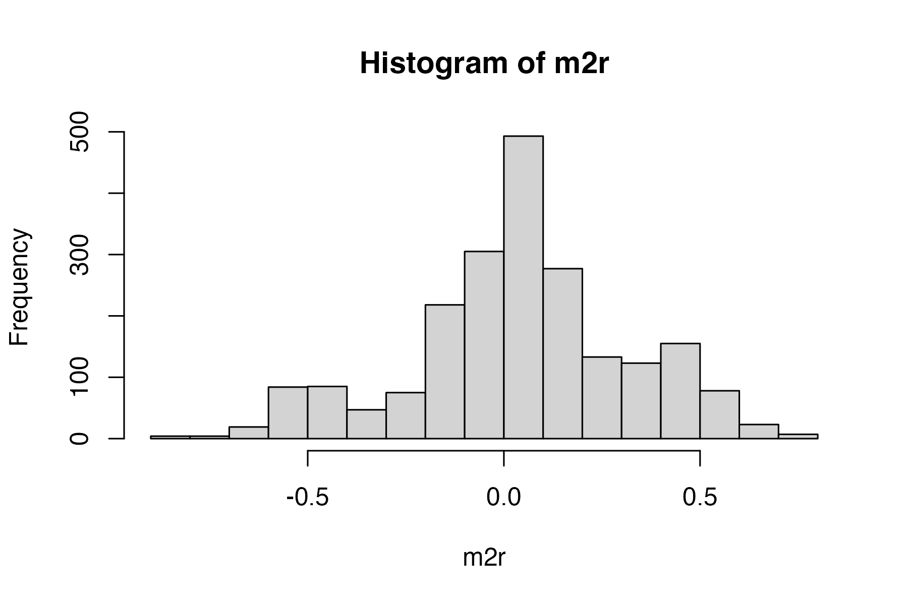
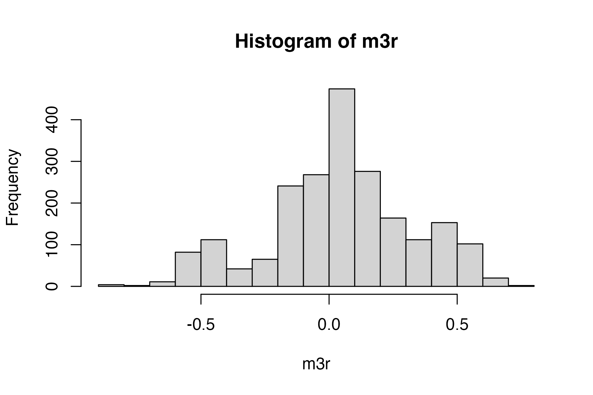

Brief Demo of Empirical Logit Regression
================
2022-04-27

Let’s consider the data for just the children with typical hearing.

``` r
data_all <- here::here("./data/ha_matched_kids.csv") %>% 
  read_csv(
    col_select = c(
      "ResearchID", "ChildStudyID", "Group", "Study", 
      "Condition", "Time", "WordGroup", "TargetWord",  
      "Target", "Distractor", 
      "Prop", "elog", "elog_wts"
    )
  ) %>% 
  filter(Condition != "nonsense") %>%
  filter(TargetWord!='dog' & TargetWord!='tag')

data_tp1_th <- data_all %>% 
  filter(Group == "NormalHearing", Study == "TimePoint1")

glimpse(data_tp1_th)
#> Rows: 2,139
#> Columns: 13
#> $ ResearchID   <chr> "014L", "014L", "014L", "014L", "014L", "014L", "014L", "…
#> $ ChildStudyID <dbl> 141, 141, 141, 141, 141, 141, 141, 141, 141, 141, 141, 14…
#> $ Group        <chr> "NormalHearing", "NormalHearing", "NormalHearing", "Norma…
#> $ Study        <chr> "TimePoint1", "TimePoint1", "TimePoint1", "TimePoint1", "…
#> $ Condition    <chr> "MP", "real", "real", "MP", "MP", "MP", "MP", "MP", "MP",…
#> $ Time         <dbl> 1800, 1500, 1450, 300, 1750, 1400, 1450, 400, 1350, 500, …
#> $ WordGroup    <chr> "duck", "duck", "duck", "soup", "duck", "duck", "duck", "…
#> $ TargetWord   <chr> "guk", "duck", "duck", "Sup", "guk", "guk", "guk", "Sup",…
#> $ Target       <dbl> 6, 9, 9, 3, 6, 6, 6, 3, 6, 3, 6, 6, 3, 3, 9, 3, 6, 3, 3, …
#> $ Distractor   <dbl> 0, 3, 3, 3, 0, 0, 0, 3, 0, 3, 0, 0, 3, 3, 3, 3, 0, 3, 3, …
#> $ Prop         <dbl> 1.00, 0.75, 0.75, 0.50, 1.00, 1.00, 1.00, 0.50, 1.00, 0.5…
#> $ elog         <dbl> 2.5649494, 0.9985288, 0.9985288, 0.0000000, 2.5649494, 2.…
#> $ elog_wts     <dbl> 2.1538462, 0.3909774, 0.3909774, 0.5714286, 2.1538462, 2.…
```

Barr (2008) provides a description and motivation of empirical logit
regression.

> When transforming data onto the log odds scale, either for
> visualization purposes or to filter out eyemovement based dependencies
> in the data, problems arise applying the \[logit\] link function
> whenever the probability *φ* approaches zero or one. This is because
> the resulting *η* will approach negative or positive infinity. Agresti
> (2002), and McCullagh and Nelder (1989) recommend instead the
> empirical logit transformation. To compute the empirical logit, it is
> necessary to aggregate over multiple observations. Instead of
> computing proportions and applying the link function, one computes:

$$\\eta' = \\ln ( \\frac{y + .5}{n - y + .5} ) $$

> In the equation, *y* is the number of times that the target event was
> observed, and *n* is the total number of cases over which *y* was
> observed. When performing empirical logit regression, McCullagh and
> Nelder (1989) suggest performing a weighted linear regression with
> weights 1/*ν* where

$$ \\nu = \\frac{1}{y + .5} + \\frac{1}{n - y + .5} $$

So we can compute them as follows:

``` r
data_tp1_th <- data_tp1_th %>%
  mutate(
    events = Target + Distractor,
    elogit = log((Target + .5) / (Distractor + .5)),
    elogit_wts = (1 / (Target + .5)) + (1 / (Distractor + .5))
  )
```

Note that these values match what we had precomputed already:

``` r
data_tp1_th %>%
  dplyr::select(events, elog, elogit, elog_wts, elogit_wts)
#> # A tibble: 2,139 × 5
#>    events  elog elogit elog_wts elogit_wts
#>     <dbl> <dbl>  <dbl>    <dbl>      <dbl>
#>  1      6 2.56   2.56     2.15       2.15 
#>  2     12 0.999  0.999    0.391      0.391
#>  3     12 0.999  0.999    0.391      0.391
#>  4      6 0      0        0.571      0.571
#>  5      6 2.56   2.56     2.15       2.15 
#>  6      6 2.56   2.56     2.15       2.15 
#>  7      6 2.56   2.56     2.15       2.15 
#>  8      6 0      0        0.571      0.571
#>  9      6 2.56   2.56     2.15       2.15 
#> 10      6 0      0        0.571      0.571
#> # … with 2,129 more rows
```

We can look at the weights applied to the model (the `1 / elogit_wts`
form) as a function of how much information (events) that point
contains.

``` r
ggplot(data_tp1_th) + 
  aes(x = events, y = 1 / elogit_wts) + 
  geom_point()
```



Bins where there are very few events receive a lower weight than bins
with more events.

Things get a little more complicated when we look at the gaze proportion
associated with each weight.

``` r
ggplot(data_tp1_th) + 
  aes(x = Prop, y = 1 / elogit_wts) + 
  geom_text(aes(label = events))
#> Warning: Removed 9 rows containing missing values (geom_text).
```


This weighting scheme upweights proportions in the middle compared to
events at the ends. Those are also the proportions with largest absolute
elogit values.

I am not sure how to convey it visually but here are the proportions
converted into elogits with points sized by model weights.

``` r
ggplot(data_tp1_th) + 
  aes(x = Prop, y = elogit, size = 1 / elogit_wts ) + 
  geom_text(aes(label = events))
#> Warning: Removed 9 rows containing missing values (geom_text).
```


## Modeling

Let’s set up a simple example with an unweighted versus and weighted
model. Note that MC changed the factor smooths for item from Word
*group* to target word. We don’t want to model hierarchical effects at
the item level (i.e., lumping both the correct and mispronunciations
together for the factor smooths). We want to allow different amounts of
wiggliness for each and every item.

After MC’s edits, model comparison now favors the un-weighted model in
the more appropriate, non-gaussian model.

``` r
library(mgcv)
#> Loading required package: nlme
#> 
#> Attaching package: 'nlme'
#> The following object is masked from 'package:dplyr':
#> 
#>     collapse
#> This is mgcv 1.8-38. For overview type 'help("mgcv-package")'.

as_difference_factor <- function(xs, ordering = NULL) {
  if (!is.null(ordering)) {
    xs <- ordered(xs, ordering)
  } else {
    xs <- ordered(xs)
  }
  contrasts(xs) <- "contr.treatment"
  xs
}

data_tp1_th$Condition_Diff <- as_difference_factor(data_tp1_th$Condition)

data_tp1_th <- data_tp1_th %>% 
  arrange(ResearchID, ChildStudyID, Condition, WordGroup, Time) %>% 
  mutate(
    ChildStudyFactor = factor(ChildStudyID),
    TargetWordFactor = factor(TargetWord),
    model_weights = 1 / elogit_wts
  ) %>% 
  group_by(ResearchID, ChildStudyID, Condition, WordGroup) %>% 
  mutate(
    ar_starts = Time == min(Time)
  ) %>% 
  ungroup()

m1 <- bam(
  elogit ~ Condition + 
    s(Time) + 
    s(Time, by = Condition_Diff) + 
    s(TargetWordFactor, bs = "re") +
    s(TargetWordFactor, bs = "re", by = Condition_Diff) + 
    s(Time, ChildStudyFactor, bs = "fs", m = 1) + 
    s(Time, ChildStudyFactor, bs = "fs", m = 1, by = Condition_Diff), 
  method = "fREML",
  discrete=TRUE,
  family="scat",
  data = data_tp1_th
)
#> Warning in gam.side(sm, X, tol = .Machine$double.eps^0.5): model has repeated 1-
#> d smooths of same variable.
#> Warning in estimate.theta(theta, family, y, mu, scale = scale1, wt = G$w, : step
#> failure in theta estimation

#> Warning in estimate.theta(theta, family, y, mu, scale = scale1, wt = G$w, : step
#> failure in theta estimation

#> Warning in estimate.theta(theta, family, y, mu, scale = scale1, wt = G$w, : step
#> failure in theta estimation

#> Warning in estimate.theta(theta, family, y, mu, scale = scale1, wt = G$w, : step
#> failure in theta estimation

#> Warning in estimate.theta(theta, family, y, mu, scale = scale1, wt = G$w, : step
#> failure in theta estimation

#> Warning in estimate.theta(theta, family, y, mu, scale = scale1, wt = G$w, : step
#> failure in theta estimation

#> Warning in estimate.theta(theta, family, y, mu, scale = scale1, wt = G$w, : step
#> failure in theta estimation
summary(m1)
#> 
#> Family: Scaled t(Inf,1.33) 
#> Link function: identity 
#> 
#> Formula:
#> elogit ~ Condition + s(Time) + s(Time, by = Condition_Diff) + 
#>     s(TargetWordFactor, bs = "re") + s(TargetWordFactor, bs = "re", 
#>     by = Condition_Diff) + s(Time, ChildStudyFactor, bs = "fs", 
#>     m = 1) + s(Time, ChildStudyFactor, bs = "fs", m = 1, by = Condition_Diff)
#> 
#> Parametric coefficients:
#>               Estimate Std. Error t value Pr(>|t|)    
#> (Intercept)   -0.03225    0.23886  -0.135 0.892613    
#> Conditionreal  1.31252    0.34912   3.760 0.000175 ***
#> ---
#> Signif. codes:  0 '***' 0.001 '**' 0.01 '*' 0.05 '.' 0.1 ' ' 1
#> 
#> Approximate significance of smooth terms:
#>                                                edf Ref.df      F  p-value    
#> s(Time)                                      2.736  3.163  1.736     0.15    
#> s(Time):Condition_Diffreal                   3.773  4.377  8.218 1.27e-06 ***
#> s(TargetWordFactor)                          7.281  8.000 29.997  < 2e-16 ***
#> s(TargetWordFactor):Condition_Diffreal       0.312  4.000  2.410     0.32    
#> s(Time,ChildStudyFactor)                    28.646 62.000  3.590  < 2e-16 ***
#> s(Time,ChildStudyFactor):Condition_Diffreal 28.699 62.000  3.203  < 2e-16 ***
#> ---
#> Signif. codes:  0 '***' 0.001 '**' 0.01 '*' 0.05 '.' 0.1 ' ' 1
#> 
#> R-sq.(adj) =    0.4   Deviance explained =   42%
#> fREML = 3158.6  Scale est. = 1         n = 2139

m2 <- bam(
  elogit ~ Condition + 
    s(Time) + 
    s(Time, by = Condition_Diff) + 
    s(TargetWordFactor, bs = "re") +
    s(TargetWordFactor, bs = "re", by = Condition_Diff) +
    s(Time, ChildStudyFactor, bs = "fs", m = 1) + 
    s(Time, ChildStudyFactor, bs = "fs", m = 1, by = Condition_Diff), 
  weights = data_tp1_th$model_weights, 
  method = "fREML",
  discrete = TRUE,
  family="scat",
  data = data_tp1_th
)
#> Warning in gam.side(sm, X, tol = .Machine$double.eps^0.5): model has repeated 1-
#> d smooths of same variable.
summary(m2)
#> 
#> Family: Scaled t(3,0.523) 
#> Link function: identity 
#> 
#> Formula:
#> elogit ~ Condition + s(Time) + s(Time, by = Condition_Diff) + 
#>     s(TargetWordFactor, bs = "re") + s(TargetWordFactor, bs = "re", 
#>     by = Condition_Diff) + s(Time, ChildStudyFactor, bs = "fs", 
#>     m = 1) + s(Time, ChildStudyFactor, bs = "fs", m = 1, by = Condition_Diff)
#> 
#> Parametric coefficients:
#>               Estimate Std. Error t value Pr(>|t|)   
#> (Intercept)   -0.01266    0.12263  -0.103  0.91776   
#> Conditionreal  0.75429    0.25231   2.990  0.00283 **
#> ---
#> Signif. codes:  0 '***' 0.001 '**' 0.01 '*' 0.05 '.' 0.1 ' ' 1
#> 
#> Approximate significance of smooth terms:
#>                                                edf Ref.df      F p-value    
#> s(Time)                                      3.250  3.588  1.931  0.1063    
#> s(Time):Condition_Diffreal                   2.143  2.300  2.284  0.0875 .  
#> s(TargetWordFactor)                          5.347  8.000 32.328  0.0454 *  
#> s(TargetWordFactor):Condition_Diffreal       2.492  4.000 66.862  0.1639    
#> s(Time,ChildStudyFactor)                    42.975 62.000 22.719  <2e-16 ***
#> s(Time,ChildStudyFactor):Condition_Diffreal 50.872 62.000 16.882  <2e-16 ***
#> ---
#> Signif. codes:  0 '***' 0.001 '**' 0.01 '*' 0.05 '.' 0.1 ' ' 1
#> 
#> R-sq.(adj) =  0.271   Deviance explained = 31.4%
#> fREML =   5034  Scale est. = 1         n = 2139

itsadug::compareML(m1, m2) # model with re-weighted data performs worse
#> m1: elogit ~ Condition + s(Time) + s(Time, by = Condition_Diff) + 
#>     s(TargetWordFactor, bs = "re") + s(TargetWordFactor, bs = "re", 
#>     by = Condition_Diff) + s(Time, ChildStudyFactor, bs = "fs", 
#>     m = 1) + s(Time, ChildStudyFactor, bs = "fs", m = 1, by = Condition_Diff)
#> 
#> m2: elogit ~ Condition + s(Time) + s(Time, by = Condition_Diff) + 
#>     s(TargetWordFactor, bs = "re") + s(TargetWordFactor, bs = "re", 
#>     by = Condition_Diff) + s(Time, ChildStudyFactor, bs = "fs", 
#>     m = 1) + s(Time, ChildStudyFactor, bs = "fs", m = 1, by = Condition_Diff)
#> 
#> Model m1 preferred: lower fREML score (1875.420), and equal df (0.000).
#> -----
#>   Model    Score Edf Difference    Df
#> 1    m2 5034.042  12                 
#> 2    m1 3158.623  12   1875.420 0.000
#> 
#> AIC difference: -842.36, model m1 has lower AIC.
```

Let’s also do the rho thing. I already sort the data to have increasing
time values within a child x condition x word group.

``` r
rho <- itsadug::start_value_rho(m1, plot = TRUE)
```


``` r
m3 <- bam(
  elogit ~ Condition + 
    s(Time) + 
    s(Time, by = Condition_Diff) + 
    s(TargetWordFactor, bs = "re") +
    s(TargetWordFactor, bs = "re", by = Condition_Diff) +
    s(Time, ChildStudyFactor, bs = "fs", m = 1) + 
    s(Time, ChildStudyFactor, bs = "fs", m = 1, by = Condition_Diff), 
  weights = data_tp1_th$model_weights, 
  method = "fREML",
  discrete = TRUE,
  family="scat",
  rho = rho, 
  AR.start = data_tp1_th$ar_starts,
  data = data_tp1_th
)
#> Warning in gam.side(sm, X, tol = .Machine$double.eps^0.5): model has repeated 1-
#> d smooths of same variable.

itsadug::compareML(m1, m3)
#> m1: elogit ~ Condition + s(Time) + s(Time, by = Condition_Diff) + 
#>     s(TargetWordFactor, bs = "re") + s(TargetWordFactor, bs = "re", 
#>     by = Condition_Diff) + s(Time, ChildStudyFactor, bs = "fs", 
#>     m = 1) + s(Time, ChildStudyFactor, bs = "fs", m = 1, by = Condition_Diff)
#> 
#> m3: elogit ~ Condition + s(Time) + s(Time, by = Condition_Diff) + 
#>     s(TargetWordFactor, bs = "re") + s(TargetWordFactor, bs = "re", 
#>     by = Condition_Diff) + s(Time, ChildStudyFactor, bs = "fs", 
#>     m = 1) + s(Time, ChildStudyFactor, bs = "fs", m = 1, by = Condition_Diff)
#> 
#> Model m1 preferred: lower fREML score (176.198), and equal df (0.000).
#> -----
#>   Model    Score Edf Difference    Df
#> 1    m3 3334.821  12                 
#> 2    m1 3158.623  12    176.198 0.000
#> 
#> AIC difference: 2267.69, model m3 has lower AIC.
```

### Residuals

We don’t care about elogit residuals. We care about the difference
between the proportions.

``` r
m1r <- data_tp1_th$Prop - plogis(fitted(m1))
summary(m1r)
#>     Min.  1st Qu.   Median     Mean  3rd Qu.     Max.     NA's 
#> -0.81599 -0.15910  0.03607 -0.00498  0.14661  0.72299        9
hist(m1r)
```



``` r
m2r <- data_tp1_th$Prop - plogis(fitted(m2))
summary(m2r)
#>     Min.  1st Qu.   Median     Mean  3rd Qu.     Max.     NA's 
#> -0.86924 -0.10101  0.04973  0.04351  0.19420  0.75680        9
hist(m2r)
```



``` r
m3r <- data_tp1_th$Prop - plogis(fitted(m3))
summary(m3r)
#>     Min.  1st Qu.   Median     Mean  3rd Qu.     Max.     NA's 
#> -0.84349 -0.10841  0.05405  0.04565  0.20877  0.75121        9
hist(m3r)
```



Distribution of average residuals is substantially improved after
combining AR1 + scaled t-distribution in model.

### Some plots

``` r
gratia::draw(m1)
```


``` r
gratia::draw(m2)
```


``` r
gratia::compare_smooths(m1, m2) %>% 
  gratia::draw()
```


``` r
gratia::smooth_estimates(
  m2, 
  c("s(Time)", "s(Time):Condition_Diffreal")
) %>%
  gratia::add_confint() %>% 
  ggplot() + 
    aes(x = Time, y = est) + 
  geom_line() +
    geom_ribbon(aes(ymin = lower_ci, ymax = upper_ci), alpha = .1) + 
  facet_wrap("smooth") + 
  labs(y = "Partial effect")
```


## References

<div id="refs" class="references csl-bib-body hanging-indent">

<div id="ref-Barr2008" class="csl-entry">

Barr, Dale J. 2008. “Analyzing ‘Visual World’ Eyetracking Data Using
Multilevel Logistic Regression.” *Journal of Memory and Language* 59
(November): 457–74. <https://doi.org/10.1016/j.jml.2007.09.002>.

</div>

</div>
