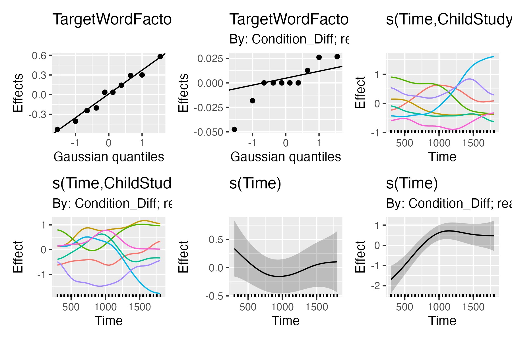
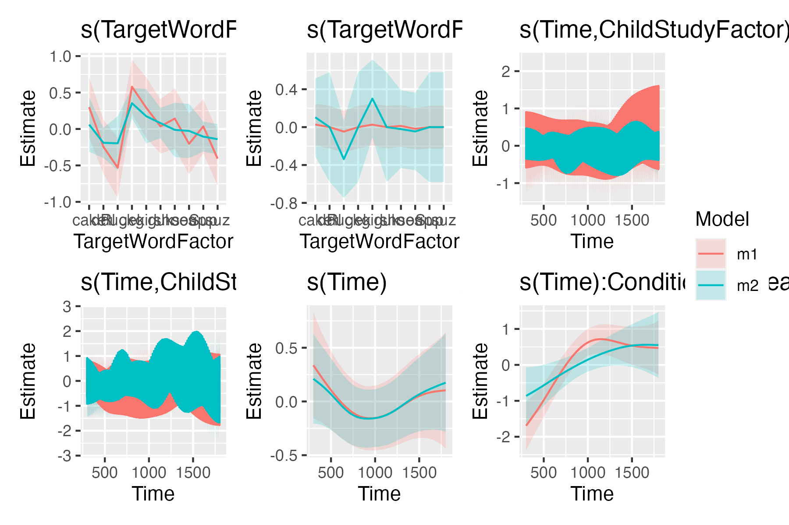

Brief Demo of Empirical Logit Regression
================
2022-04-27

Let’s consider the data for just the children with typical hearing.

``` r
library(tidyverse)
data_all <- here::here("ha_matched_kids.csv") |> 
  read_csv(
    col_select = c(
      "ResearchID", "ChildStudyID", "Group", "Study", 
      "Condition", "Time", "WordGroup", "TargetWord",  
      "Target", "Distractor", 
      "Prop", "elog", "wts"
    )
  ) |> 
  filter(Condition != "nonsense")

data_tp1_th <- data_all |> 
  filter(Group == "NormalHearing", Study == "TimePoint1")

glimpse(data_tp1_th)
#> Rows: 2,573
#> Columns: 13
#> $ ResearchID   <chr> "014L", "014L", "014L", "014L", "014L", "014L", "014L", "…
#> $ ChildStudyID <dbl> 141, 141, 141, 141, 141, 141, 141, 141, 141, 141, 141, 14…
#> $ Group        <chr> "NormalHearing", "NormalHearing", "NormalHearing", "Norma…
#> $ Study        <chr> "TimePoint1", "TimePoint1", "TimePoint1", "TimePoint1", "…
#> $ Condition    <chr> "MP", "real", "real", "MP", "MP", "MP", "MP", "MP", "MP",…
#> $ Time         <dbl> 1800, 1500, 1450, 300, 1750, 1400, 1450, 400, 1350, 500, …
#> $ WordGroup    <chr> "duck", "duck", "duck", "soup", "duck", "duck", "duck", "…
#> $ TargetWord   <chr> "guk", "duck", "duck", "Sup", "guk", "guk", "guk", "Sup",…
#> $ Target       <dbl> 6, 9, 9, 3, 6, 6, 6, 3, 6, 3, 6, 6, 3, 3, 9, 3, 6, 3, 3, …
#> $ Distractor   <dbl> 0, 3, 3, 3, 0, 0, 0, 3, 0, 3, 0, 0, 3, 3, 3, 3, 0, 3, 3, …
#> $ Prop         <dbl> 1.00, 0.75, 0.75, 0.50, 1.00, 1.00, 1.00, 0.50, 1.00, 0.5…
#> $ elog         <dbl> 2.5649494, 0.9985288, 0.9985288, 0.0000000, 2.5649494, 2.…
#> $ wts          <dbl> 2.1538462, 0.3909774, 0.3909774, 0.5714286, 2.1538462, 2.…
```

Barr (2008) provides a description and motivation of empirical logit
regression.

> When transforming data onto the log odds scale, either for
> visualization purposes or to filter out eyemovement based dependencies
> in the data, problems arise applying the \[logit\] link function
> whenever the probability *φ* approaches zero or one. This is because
> the resulting *η* will approach negative or positive infinity. Agresti
> (2002), and McCullagh and Nelder (1989) recommend instead the
> empirical logit transformation. To compute the empirical logit, it is
> necessary to aggregate over multiple observations. Instead of
> computing proportions and applying the link function, one computes:

 ")

> In the equation, *y* is the number of times that the target event was
> observed, and *n* is the total number of cases over which *y* was
> observed. When performing empirical logit regression, McCullagh and
> Nelder (1989) suggest performing a weighted linear regression with
> weights 1/*ν* where


So we can compute them as follows:

``` r
data_tp1_th <- data_tp1_th |> 
  mutate(
    events = Target + Distractor,
    elogit = log((Target + .5) / (Distractor + .5)),
    elogit_wts = (1 / (Target + .5)) + (1 / (Distractor + .5))
  ) 
```

Note that these values match what we had precomputed already:

``` r
data_tp1_th |>
  select(events, elog, elogit, wts, elogit_wts)
#> # A tibble: 2,573 × 5
#>    events  elog elogit   wts elogit_wts
#>     <dbl> <dbl>  <dbl> <dbl>      <dbl>
#>  1      6 2.56   2.56  2.15       2.15 
#>  2     12 0.999  0.999 0.391      0.391
#>  3     12 0.999  0.999 0.391      0.391
#>  4      6 0      0     0.571      0.571
#>  5      6 2.56   2.56  2.15       2.15 
#>  6      6 2.56   2.56  2.15       2.15 
#>  7      6 2.56   2.56  2.15       2.15 
#>  8      6 0      0     0.571      0.571
#>  9      6 2.56   2.56  2.15       2.15 
#> 10      6 0      0     0.571      0.571
#> # … with 2,563 more rows
```

We can look at the weights applied to the model (the `1 / elogit_wts`
form) as a function of how much information (events) that point
contains.

``` r
ggplot(data_tp1_th) + 
  aes(x = events, y = 1 / elogit_wts) + 
  geom_point()
```


Bins where there are very few events receive a lower weight than bins
with more events.

Things get a little more complicated when we look at the gaze proportion
associated with each weight.

``` r
ggplot(data_tp1_th) + 
  aes(x = Prop, y = 1 / elogit_wts) + 
  geom_text(aes(label = events))
#> Warning: Removed 10 rows containing missing values (geom_text).
```


This weighting scheme upweights proportions in the middle compared to
events at the ends. Those are also the proportions with largest absolute
elogit values.

I am not sure how to convery it visually but here are the proportions
converted into elogits with points sized by model weights.

``` r
ggplot(data_tp1_th) + 
  aes(x = Prop, y = elogit, size = 1 / elogit_wts ) + 
  geom_text(aes(label = events))
#> Warning: Removed 10 rows containing missing values (geom_text).
```


## Modeling

Let’s set up a simple example with an unweighted versus and weighted
model. Model comparison favors the weighted model.

``` r
library(mgcv)
#> Loading required package: nlme
#> 
#> Attaching package: 'nlme'
#> The following object is masked from 'package:dplyr':
#> 
#>     collapse
#> This is mgcv 1.8-40. For overview type 'help("mgcv-package")'.

as_difference_factor <- function(xs, ordering = NULL) {
  if (!is.null(ordering)) {
    xs <- ordered(xs, ordering)
  } else {
    xs <- ordered(xs)
  }
  contrasts(xs) <- "contr.treatment"
  xs
}

data_tp1_th$Condition_Diff <- as_difference_factor(data_tp1_th$Condition)

data_tp1_th <- data_tp1_th |> 
  arrange(ResearchID, ChildStudyID, Condition, WordGroup, Time) |> 
  mutate(
    ChildStudyFactor = factor(ChildStudyID),
    WordGroupFactor = factor(WordGroup),
    model_weights = 1 / elogit_wts
  ) |> 
  group_by(ResearchID, ChildStudyID, Condition, WordGroup) |> 
  mutate(
    ar_starts = Time == min(Time)
  ) |> 
  ungroup()

m1 <- bam(
  elogit ~ Condition + 
    s(Time) + 
    s(Time, by = Condition_Diff) + 
    s(WordGroupFactor, bs = "re") +
    s(WordGroupFactor, bs = "re", by = Condition_Diff) +
    s(Time, ChildStudyFactor, bs = "fs", m = 1) + 
    s(Time, ChildStudyFactor, bs = "fs", m = 1, by = Condition_Diff), 
  method = "REML",
  data = data_tp1_th
)
#> Warning in gam.side(sm, X, tol = .Machine$double.eps^0.5): model has repeated 1-
#> d smooths of same variable.
summary(m1)
#> 
#> Family: gaussian 
#> Link function: identity 
#> 
#> Formula:
#> elogit ~ Condition + s(Time) + s(Time, by = Condition_Diff) + 
#>     s(WordGroupFactor, bs = "re") + s(WordGroupFactor, bs = "re", 
#>     by = Condition_Diff) + s(Time, ChildStudyFactor, bs = "fs", 
#>     m = 1) + s(Time, ChildStudyFactor, bs = "fs", m = 1, by = Condition_Diff)
#> 
#> Parametric coefficients:
#>               Estimate Std. Error t value Pr(>|t|)    
#> (Intercept)    -0.0478     0.1973  -0.242    0.809    
#> Conditionreal   1.4423     0.3172   4.548 5.68e-06 ***
#> ---
#> Signif. codes:  0 '***' 0.001 '**' 0.01 '*' 0.05 '.' 0.1 ' ' 1
#> 
#> Approximate significance of smooth terms:
#>                                                edf Ref.df       F p-value    
#> s(Time)                                      2.409  2.790   2.033   0.182    
#> s(Time):Condition_Diffreal                   3.712  4.332   9.822  <2e-16 ***
#> s(WordGroupFactor)                           4.640  5.000 303.533  <2e-16 ***
#> s(WordGroupFactor):Condition_Diffreal        4.628  5.000 293.272  <2e-16 ***
#> s(Time,ChildStudyFactor)                    27.041 62.000   3.086  <2e-16 ***
#> s(Time,ChildStudyFactor):Condition_Diffreal 26.635 62.000   3.325  <2e-16 ***
#> ---
#> Signif. codes:  0 '***' 0.001 '**' 0.01 '*' 0.05 '.' 0.1 ' ' 1
#> 
#> R-sq.(adj) =  0.367   Deviance explained = 38.4%
#> -REML = 4623.5  Scale est. = 1.9953    n = 2573

m2 <- bam(
  elogit ~ Condition + 
    s(Time) + 
    s(Time, by = Condition_Diff) + 
    s(WordGroupFactor, bs = "re") +
    s(WordGroupFactor, bs = "re", by = Condition_Diff) +
    s(Time, ChildStudyFactor, bs = "fs", m = 1) + 
    s(Time, ChildStudyFactor, bs = "fs", m = 1, by = Condition_Diff), 
  data = data_tp1_th, 
  weights = data_tp1_th$model_weights, 
  method = "REML"
)
#> Warning in gam.side(sm, X, tol = .Machine$double.eps^0.5): model has repeated 1-
#> d smooths of same variable.
summary(m2)
#> 
#> Family: gaussian 
#> Link function: identity 
#> 
#> Formula:
#> elogit ~ Condition + s(Time) + s(Time, by = Condition_Diff) + 
#>     s(WordGroupFactor, bs = "re") + s(WordGroupFactor, bs = "re", 
#>     by = Condition_Diff) + s(Time, ChildStudyFactor, bs = "fs", 
#>     m = 1) + s(Time, ChildStudyFactor, bs = "fs", m = 1, by = Condition_Diff)
#> 
#> Parametric coefficients:
#>               Estimate Std. Error t value Pr(>|t|)    
#> (Intercept)    -0.0360     0.1092  -0.330 0.741796    
#> Conditionreal   0.9038     0.2446   3.695 0.000225 ***
#> ---
#> Signif. codes:  0 '***' 0.001 '**' 0.01 '*' 0.05 '.' 0.1 ' ' 1
#> 
#> Approximate significance of smooth terms:
#>                                                edf Ref.df       F  p-value    
#> s(Time)                                      3.107  3.701   2.765   0.0321 *  
#> s(Time):Condition_Diffreal                   3.287  3.821   7.697 9.27e-06 ***
#> s(WordGroupFactor)                           4.537  5.000  73.464 5.84e-07 ***
#> s(WordGroupFactor):Condition_Diffreal        4.641  5.000 110.245  < 2e-16 ***
#> s(Time,ChildStudyFactor)                    19.728 62.000   1.496  < 2e-16 ***
#> s(Time,ChildStudyFactor):Condition_Diffreal 28.156 62.000   2.994  < 2e-16 ***
#> ---
#> Signif. codes:  0 '***' 0.001 '**' 0.01 '*' 0.05 '.' 0.1 ' ' 1
#> 
#> R-sq.(adj) =  0.264   Deviance explained = 28.8%
#> -REML = 4251.2  Scale est. = 1.5019    n = 2573

itsadug::compareML(m1, m2)
#> m1: elogit ~ Condition + s(Time) + s(Time, by = Condition_Diff) + 
#>     s(WordGroupFactor, bs = "re") + s(WordGroupFactor, bs = "re", 
#>     by = Condition_Diff) + s(Time, ChildStudyFactor, bs = "fs", 
#>     m = 1) + s(Time, ChildStudyFactor, bs = "fs", m = 1, by = Condition_Diff)
#> 
#> m2: elogit ~ Condition + s(Time) + s(Time, by = Condition_Diff) + 
#>     s(WordGroupFactor, bs = "re") + s(WordGroupFactor, bs = "re", 
#>     by = Condition_Diff) + s(Time, ChildStudyFactor, bs = "fs", 
#>     m = 1) + s(Time, ChildStudyFactor, bs = "fs", m = 1, by = Condition_Diff)
#> 
#> Model m2 preferred: lower REML score (372.262), and equal df (0.000).
#> -----
#>   Model    Score Edf Difference    Df
#> 1    m1 4623.490  12                 
#> 2    m2 4251.227  12   -372.262 0.000
#> 
#> AIC difference: 1070.99, model m2 has lower AIC.
```

Let’s also do the rho thing. I already sort the data to have increasing
time values within a child x condition x word group.

``` r
rho <- itsadug::start_value_rho(m1, plot = TRUE)
```


``` r
m3 <- bam(
  elogit ~ Condition + 
    s(Time) + 
    s(Time, by = Condition_Diff) + 
    s(WordGroupFactor, bs = "re") +
    s(WordGroupFactor, bs = "re", by = Condition_Diff) +
    s(Time, ChildStudyFactor, bs = "fs", m = 1) + 
    s(Time, ChildStudyFactor, bs = "fs", m = 1, by = Condition_Diff), 
  data = data_tp1_th, 
  weights = data_tp1_th$model_weights, 
  rho = rho, 
  AR.start = data_tp1_th$ar_starts,
  method = "REML"
)
#> Warning in gam.side(sm, X, tol = .Machine$double.eps^0.5): model has repeated 1-
#> d smooths of same variable.

itsadug::compareML(m2, m3)
#> m2: elogit ~ Condition + s(Time) + s(Time, by = Condition_Diff) + 
#>     s(WordGroupFactor, bs = "re") + s(WordGroupFactor, bs = "re", 
#>     by = Condition_Diff) + s(Time, ChildStudyFactor, bs = "fs", 
#>     m = 1) + s(Time, ChildStudyFactor, bs = "fs", m = 1, by = Condition_Diff)
#> 
#> m3: elogit ~ Condition + s(Time) + s(Time, by = Condition_Diff) + 
#>     s(WordGroupFactor, bs = "re") + s(WordGroupFactor, bs = "re", 
#>     by = Condition_Diff) + s(Time, ChildStudyFactor, bs = "fs", 
#>     m = 1) + s(Time, ChildStudyFactor, bs = "fs", m = 1, by = Condition_Diff)
#> 
#> Model m3 preferred: lower REML score (2820.572), and equal df (0.000).
#> -----
#>   Model    Score Edf Difference    Df
#> 1    m2 4251.227  12                 
#> 2    m3 1430.655  12  -2820.572 0.000
#> 
#> AIC difference: 5569.15, model m3 has lower AIC.
```

### Residuals

We don’t care about elogit residuals. We care about the difference
between the proportions.

``` r
m1r <- data_tp1_th$Prop - plogis(fitted(m1))
summary(m1r)
#>      Min.   1st Qu.    Median      Mean   3rd Qu.      Max.      NA's 
#> -0.859725 -0.188670  0.031229 -0.007816  0.146409  0.745720        10
hist(m1r)
```


``` r
m2r <- data_tp1_th$Prop - plogis(fitted(m2))
summary(m2r)
#>     Min.  1st Qu.   Median     Mean  3rd Qu.     Max.     NA's 
#> -0.77127 -0.14095  0.05319  0.03222  0.22698  0.64609       10
hist(m2r)
```


``` r
m3r <- data_tp1_th$Prop - plogis(fitted(m3))
summary(m3r)
#>    Min. 1st Qu.  Median    Mean 3rd Qu.    Max.    NA's 
#> -0.6275 -0.1312  0.1479  0.1100  0.4378  0.6112      10
hist(m3r)
```


What this autocorrelation does to the average residual here is bonkers.
Maybe we should not use it?

### Some plots

``` r
gratia::draw(m1)
```



``` r
gratia::draw(m2)
```


``` r
gratia::compare_smooths(m1, m2) |> 
  gratia::draw()
```



``` r
gratia::smooth_estimates(
  m2, 
  c("s(Time)", "s(Time):Condition_Diffreal")
) |>
  gratia::add_confint() |> 
  ggplot() + 
    aes(x = Time, y = est) + 
  geom_line() +
    geom_ribbon(aes(ymin = lower_ci, ymax = upper_ci), alpha = .1) + 
  facet_wrap("smooth") + 
  labs(y = "Partial effect")
```


## References

<div id="refs" class="references csl-bib-body hanging-indent">

<div id="ref-Barr2008" class="csl-entry">

Barr, Dale J. 2008. “Analyzing ‘Visual World’ Eyetracking Data Using
Multilevel Logistic Regression.” *Journal of Memory and Language* 59
(November): 457–74. <https://doi.org/10.1016/j.jml.2007.09.002>.

</div>

</div>
